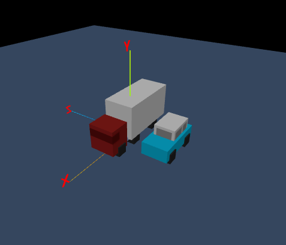

Don't know yet. Something based on [Hunor Marton Borbely's](https://hunormarton.github.io/) Traffic Run.

https://www.freecodecamp.org/news/three-js-tutorial/

# Installation

## three.js
npm install --save three

## cannon.js
npm install --save cannon-es

## vite
npm install --save-dev vite

# Run
npx vite

# Screenshots
